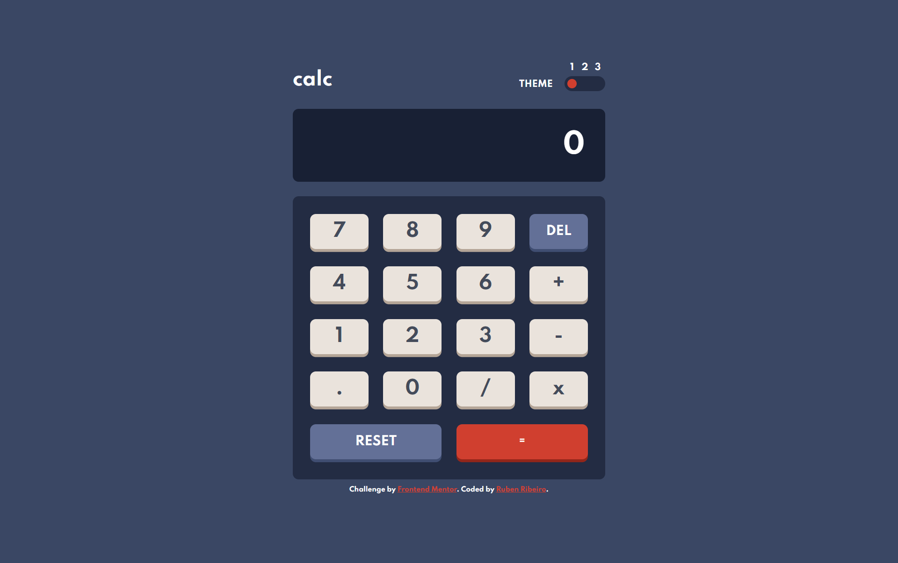

# Frontend Mentor - Calculator app solution

This is a solution to the [Calculator app challenge on Frontend Mentor](https://www.frontendmentor.io/challenges/calculator-app-9lteq5N29). Frontend Mentor challenges help you improve your coding skills by building realistic projects. 

## Table of contents

- [Overview](#overview)
  - [The challenge](#the-challenge)
  - [Screenshots](#screenshots)
  - [Links](#links)
- [My process](#my-process)
  - [Built with](#built-with)
  - [What I learned](#what-i-learned)
  - [Continued development](#continued-development)
  - [Useful resources](#useful-resources)
- [Author](#author)

## Overview

### The challenge

Users should be able to:

- See the size of the elements adjust based on their device's screen size
- Perform mathmatical operations like addition, subtraction, multiplication, and division
- Adjust the color theme based on their preference
- Have their initial theme preference checked using `prefers-color-scheme` and have any additional changes saved in the browser

### Screenshots




### Links

- Solution URL: [https://github.com/RubenRibeiro13/calculator-app](https://github.com/RubenRibeiro13/calculator-app)
- Live Site URL: [https://rubenribeiro13.github.io/calculator-app/](https://rubenribeiro13.github.io/calculator-app/)

## My process

### Built with

- Semantic HTML5 markup
- CSS custom properties
- Flexbox
- CSS Grid
- [jQuery](https://jquery.com/) - JS library

### What I learned

While working through this project, I learned:
- How to style a slider.
- What the list-style-type, overflow and white-space CSS properties specify.
- What the calc CSS function and the scrollLeft, width, match, splice, shift and matchMedia JavaScript/jQuery methods do.
- What the scrollWidth JavaScript property returns.
- About the let keyword and the localStorage object.

```css

input {
  -webkit-appearance: none;
  background: transparent;
  width: 70px;
  margin: 0;
}

input::-webkit-slider-runnable-track {
  cursor: pointer;
  border-radius: 13px;
  height: 26px;
}

input::-webkit-slider-thumb {
  -webkit-appearance: none;
  border-radius: 50%;
  width: 16px;
  height: 16px;
  margin-top: 5px;
}

input::-moz-range-track {
  cursor: pointer;
  border-radius: 13px;
  height: 26px;
}

input::-moz-range-thumb {
  cursor: pointer;
  border-radius: 50%;
  width: 16px;
  height: 16px;
}

.slider-theme-1::-webkit-slider-runnable-track {
  background: #232c43;
}

.slider-theme-1::-webkit-slider-thumb {
  background: #d03f2f;
  margin-left: 5px;
}

.slider-theme-1::-moz-range-track {
  background: #232c43;
}

.slider-theme-1::-moz-range-thumb {
  background: #d03f2f;
  border: 5px solid #232c43;
}

ol {
  list-style-type: none;
  font-size: 15px;
  padding: 0 5px;
  margin: 0;

  display: flex;
  justify-content: space-between;

  grid-column: 2 / 3;
}

.screen-text {
  overflow-x: auto;
  white-space: nowrap;
}

.keypad {
  border-radius: 10px;
  box-sizing: border-box;
  width: 87%;
  max-width: 535px;
  padding: 30px 30px 35px;
  margin: 0 auto;

  display: grid;
  grid-template-columns: repeat(4, 1fr);
  gap: min(calc(3vw + 5px), calc(25px + 5px)) min(3vw, 25px);
}

```

```js

if (numbers.length === 0 || numbers[0] === 0) {
  mathExpression = "";
  $(".screen-text").text("0");
}
else if (!isFinite(numbers[0]) || isNaN(numbers[0])) {
  mathExpression = "";
  $(".screen-text").text("Error");
}
else {
  mathExpression = ("" + numbers[0]).replace(".", ",");
  $(".screen-text").text(mathExpression).scrollLeft($(".screen-text")[0].scrollWidth - $(".screen-text").width());
}

var numbers = [];
if (/([x/][-])?[0-9]+[.]?[0-9]*([e][-+][0-9]+)?/.test(mathExpression)) {
  numbers = mathExpression.match(/([x/][-])?[0-9]+[.]?[0-9]*([e][-+][0-9]+)?/g);
}
for (let i = 0; i < numbers.length; i++) {
  numbers[i] = numbers[i].replace(/[x/]/, "");
  numbers[i] = numbers[i] / 1;
}

while (operators.length > 0) {
  if (operators[0] === "+") {
    numbers.splice(0, 2, numbers[0] + numbers[1]);
  }
  else {
    numbers.splice(0, 2, numbers[0] - numbers[1]);
  }
  operators.shift();
}

if (localStorage.getItem("theme") === null) {
  if (window.matchMedia("(prefers-color-scheme: light)").matches) {
    $("input").val("2");
  }
  else if (window.matchMedia("(prefers-color-scheme: dark)").matches) {
    $("input").val("3");
  }
  else {
    $("input").val("1");
  }
}
else {
  $("input").val(localStorage.getItem("theme"));
}

$("input").on("input", function() {
  applyColorScheme();
  localStorage.setItem("theme", $(this).val());
});

```

### Continued development

I want my next project to contain a submittable form.

### Useful resources

- [CSS-Tricks](https://css-tricks.com) - This resource showed me how to style a slider.
- [MDN Web Docs](https://developer.mozilla.org) - This resource is especially helpful for understanding CSS properties and functions.
- [W3Schools](https://www.w3schools.com) - This resource is especially helpful for understanding JavaScript/jQuery methods.
- [Stack Overflow](https://stackoverflow.com) - This resource showed me how to use the scrollWidth JavaScript property.

## Author

- Website - [Ruben Ribeiro](https://rubenribeiro13.github.io/my-site/)
- Frontend Mentor - [@RubenRibeiro13](https://www.frontendmentor.io/profile/RubenRibeiro13)
